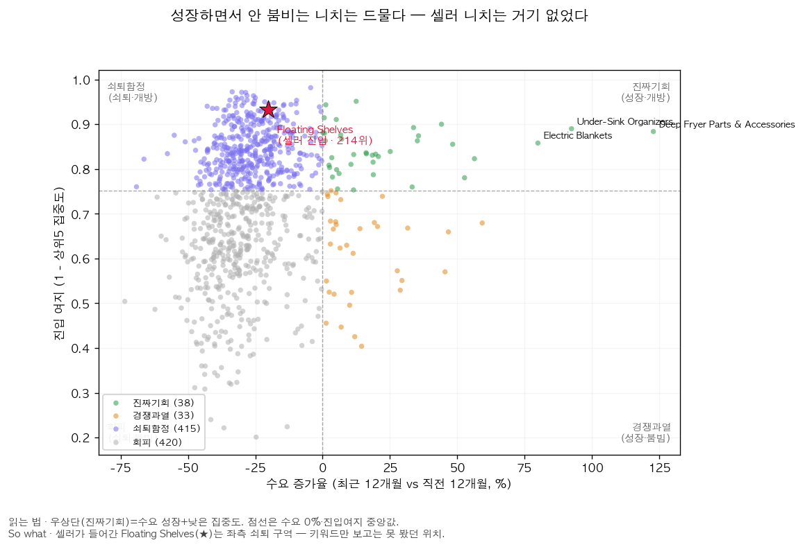
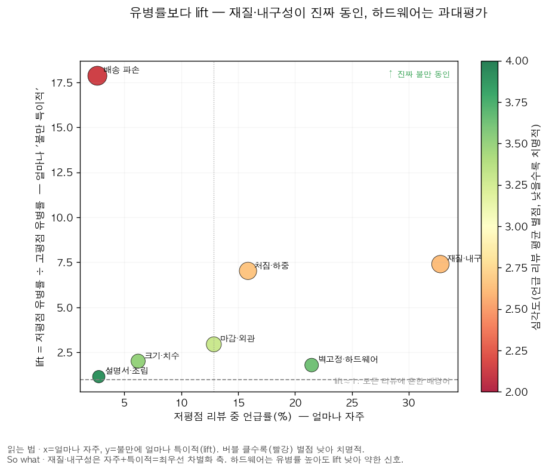
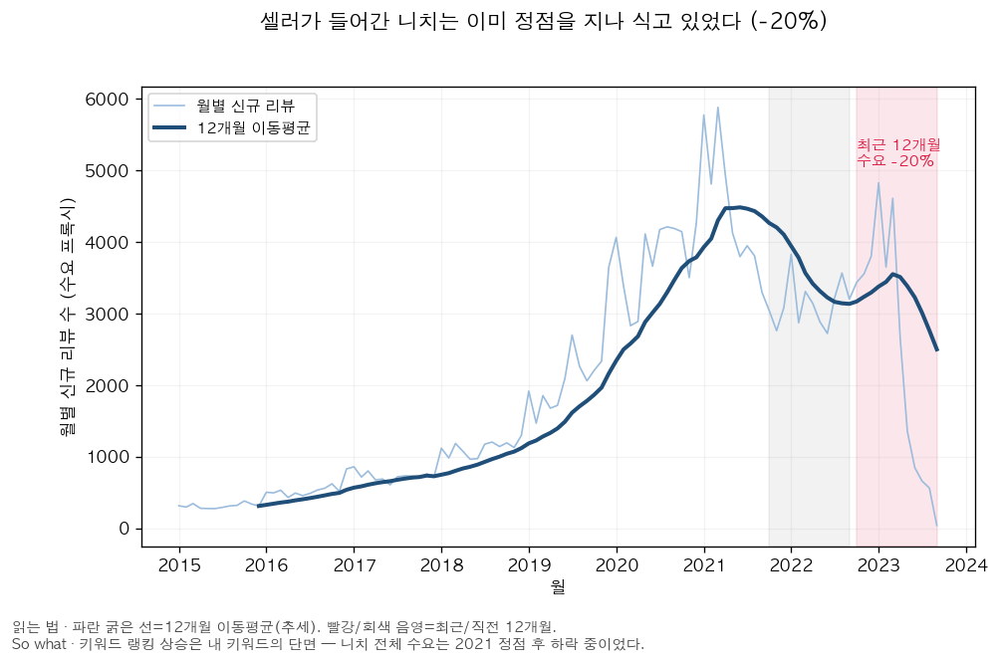

# 전직 아마존 셀러가 데이터로 다시 푸는 카테고리 진입 전략

**전직 셀러가 6,200만 건 리뷰로 자신의 진입 실패를 복기하며, 차트가 아니라 *의사결정*을 만든다 — 누수를 스스로 감사하고 한계를 측정하는 분석가의 일.**

<sub>이커머스/비즈니스 데이터 분석 · Python · DuckDB SQL · 가설 검증 · 통계적 엄밀성 · 의사결정 메모</sub>

> Hexagon wall shelves를 팔던 셀러 시절, 나는 Helium10에서 키워드 랭킹 상승세를 보고,
> 당시 시장에 매트화이트 색상이 비어 있다는 점과 사이즈별 1세트 구성으로 차별화해 진입했다.
> 이 프로젝트는 그때의 의사결정 문제를 공개 데이터(Amazon Reviews 2023, 수천만 건)로 정량화한다:
> **"신규 셀러에게 어떤 니치가 진입 가치가 있고, 어떤 초기 조건으로 들어가야 하는가?"**

## 이 프로젝트로 무엇을 보여주는가

화려한 모델이 아니라 **데이터로 비즈니스 의사결정을 정직하게 내리는 능력**을 보여준다.

| 역량 | 이 프로젝트에서 |
|---|---|
| **문제 정의 소유권** | 셀러 경험에서 질문을 끌어냄 — 남의 데이터로 남의 질문에 답하는 흔한 포트폴리오와 반대 |
| **의사결정으로 수렴** | Q1·Q2·Q3 모든 분석이 "이 니치에 진입할까 말까"라는 하나의 결정에 연결 ([의사결정 메모](report/final_report.md)) |
| **비판적 검증(정직성)** | 자기 모델에서 누수 2건을 직접 감사·수정하고 "성능이 누수가 아닌 진짜 신호"임을 입증 ([D-016](docs/decisions.md)) |
| **도구 판단력** | LLM 대신 규칙+NMF를 *이유를 대고* 선택([D-014](docs/decisions.md)), SQL=DuckDB, 6,200만 건 재개 가능 스트리밍 수집([D-010](docs/decisions.md)) |

## 핵심 결과 3개

1. **Q1 — 기회 스코어링**: 906개 니치를 채점, 가중치를 흔들어도 순위 견고(Spearman 0.858). 상위 기회: Deep Fryer Parts(+123%), Electric Blankets(+80%).
2. **Q2 — 미충족 니즈**: 저평점 28,816건에서 유병률만 보면 재질(33%)·하드웨어(21%) 순이지만, **lift(저평점÷고평점)로 보면 재질(7.4×)·처짐(7.0×)이 진짜 동인이고 하드웨어는 1.8×로 배경어에 가깝다** — 유병률만 봤다면 놓쳤을 결론. 불만 구조는 니치마다 다름(Pot Racks 하드웨어 44%).
3. **Q3 — 안착 예측**: 출시 초기 조건으로 12개월 안착 예측, PR-AUC 0.602(기준선의 3.8배). SHAP: *출시 직후 트랙션(reviews_90d)*이 압도적 1위. PDP상 첫 90일 리뷰 ~3개면 모델 안착 임계를 넘고, 세그먼트별 실제 안착률은 트래픽 따라 6%→92%로 단조 상승.




> **셀러 회고(이 프로젝트의 백미)**: 내가 실제 진입했던 Floating Shelves는 906니치 중 214위·수요 −20%의 정체 시장이었다. 키워드 상승·색상 공백이라는 단편 신호만으로는 니치 구조를 못 본다는 것 — 진입 전에 이 세 렌즈로 봤어야 했다.



> 차트는 모두 `python src/analyze/make_figures.py`가 마트(parquet)에서 직접 생성 — 문서 수치와 동일 소스라 불일치가 없다(총 11종: 기회 지도·점수 분해·순위 견고성·수요 추이·불만 히트맵/우선순위/추세·PR커브·보정·안착임계·세그먼트). 인터랙티브 탐색은 아래 [대시보드](#대시보드) 참고.

## 분석 질문
1. **Q1 니치 기회 스코어링** — Home & Kitchen 니치별 수요·경쟁·평점 갭 비교
2. **Q2 미충족 니즈 마이닝** — 저평점 리뷰 텍스트에서 차별화 진입 포인트 추출
3. **Q3 시장 안착 예측** — 출시 초기 조건으로 12개월 내 안착 여부 예측 (point-in-time 피처)

## 데이터
| 소스 | 규모 | 용도 |
|---|---|---|
| [Amazon Reviews 2023](https://huggingface.co/datasets/McAuley-Lab/Amazon-Reviews-2023) Home_and_Kitchen | 리뷰 31GB / 메타 12GB (스트리밍 수집) | 메인 |
| 〃 Tools_and_Home_Improvement 메타 | 4.9GB | 교차 등록 셸프 ASIN 보완 |

> 추가 데이터 수집은 하지 않는다. 현재 받은 Amazon Reviews 2023 데이터만으로 Q1~Q3를 완결한다.

### 데이터 출처 & 인용
- **출처**: McAuley Lab — *Amazon Reviews 2023*, HuggingFace [`McAuley-Lab/Amazon-Reviews-2023`](https://huggingface.co/datasets/McAuley-Lab/Amazon-Reviews-2023) · 프로젝트 페이지 <https://amazon-reviews-2023.github.io/>
- **고정 버전(재현성)**: HF revision `2b6d039ed471f2ba5fd2acb718bf33b0a7e5598e` (`config/config.yaml`에 고정) · 사용 범위: `Home_and_Kitchen`(+`Tools_and_Home_Improvement` 메타 교차) · 기간 2015-01~2023-09 · 수집 2026-06
- **라이선스**: HF 데이터셋 카드에 명시적 라이선스 표기 없음(프로젝트 페이지 안내) → 본 프로젝트는 **비상업 연구·포트폴리오 목적**으로만 사용. 원 데이터의 권리는 원저작자에 있음.
- **인용**:
  ```bibtex
  @article{hou2024bridging,
    title={Bridging Language and Items for Retrieval and Recommendation},
    author={Hou, Yupeng and Li, Jiacheng and He, Zhankui and Yan, An and Chen, Xiusi and McAuley, Julian},
    journal={arXiv preprint arXiv:2403.03952},
    year={2024}
  }
  ```

## 실행
```bash
make setup        # 의존성 설치
make smoke        # 5분 내 끝나는 소규모 end-to-end 검증 (수집→변환→Q1 스코어링)

# 전체 파이프라인 (수집→변환→분석). 수 시간 소요, 재개 가능·재실행 안전.
caffeinate -is bash scripts/run_full_ingest.sh
# 중간에 전원/네트워크가 끊겨도 같은 명령을 다시 실행하면 마지막 체크포인트부터 이어받음.

# 또는 단계별 실행:
make ingest-all   # 전체 수집 (resumable: 끊겨도 재실행 시 이어받음)
make transform    # staging → marts (DuckDB SQL)
make analyze      # Q1 니치 기회 스코어링 → docs/q1_niche_scorecard.md
make unmet-needs  # Q2 미충족 니즈 텍스트 마이닝 → docs/q2_unmet_needs.md
make settlement   # Q3 안착 예측 모델(LightGBM+SHAP) → docs/q3_settlement_model.md + 모델 저장
make figures      # 의사결정 차트 생성 → docs/figures/*.png
make dashboard    # Streamlit 대시보드 실행(self-serve 니치 탐색기)
```

## 대시보드
세 렌즈(Q1 기회 · Q2 차별화 · Q3 안착)를 직접 탐색하는 self-serve 도구.

```bash
make dashboard          # = python -m streamlit run streamlit_app.py
```
- **① Q1 기회**: 기회 지도(산점도) + 니치 드릴다운 + 상위 니치 표
- **② Q2 미충족 니즈**: 니치별 불만 유병률 바/비교표
- **③ Q3 안착**: 예측확률 분포 탐색 + *첫 90일 조건을 입력하면 안착 확률을 예측*하는 폼
  (학습 모델 `data/marts/q3_model.pkl` 로드, 예측 전처리는 학습 파이프라인과 동일하게 검증됨)

> 배포: 소형 마트(`mart_niche_score`·`q2_*`·`q3_predictions`·`q3_model.pkl`, 합계 ~3.7MB)만 추적하므로 Streamlit Community Cloud에 그대로 올릴 수 있다. 대용량 마트·raw는 `.gitignore` 제외.

## 탐색(EDA)
`notebooks/01_eda.ipynb` — **결론이 아니라 거기에 이른 탐색**을 보인다: 어떤 데이터 특성이 Q1/Q2/Q3 설계와 한계(L-1~L-3)를 강제했는지(수요 프록시·니치 크기 분포·저평점 텍스트·생존편향). 모든 수치는 마트에서 직접 로드.

## 구조
```
config/config.yaml   # 카테고리·니치 키워드·기간·Q1~Q3 파라미터 등 모든 설정
src/ingest/          # 수집: meta → universe → reviews → validate
src/transform/       # DuckDB SQL (staging → marts)
src/analyze/         # Q1 스코어링 · Q2 미충족 니즈 · Q3 안착 예측 · make_figures(차트)
app/dashboard.py     # Streamlit 대시보드 (streamlit_app.py 진입점)
notebooks/01_eda.ipynb  # 탐색→프레임워크 도출 노트북
docs/                # decisions.md · limitations.md · q1~q3 산출물 · figures/(차트) · 품질 리포트
report/              # 최종 의사결정 메모
```

## 정직한 한계 (요약 — 상세는 docs/limitations.md)
- 리뷰 수는 판매량의 불완전한 프록시 → 니치 간 절대 비교 대신 추세·상대 비교로 해석 제한
- 리뷰 0개로 사라진 상품은 데이터에 없음(생존 편향) → 타깃을 "안착 vs 조기 정체"로 정의
- 첫 리뷰일 ≈ 출시일 프록시 → 실제 출시일이 아니라 관측 가능한 첫 수요 반응 시점으로 해석

## 실제 데이터가 있다면 (이 분석의 천장과 확장 설계)

> 한계를 *아는 것*이 분석가의 일이다. 이 프로젝트의 결론은 "리뷰=수요 프록시"라는 천장 위에 서 있고,
> 아래는 천장을 어떻게 걷어낼지에 대한 **설계**다(이번 버전 범위 밖, 실행은 안 함).

| 데이터를 얻으면 | 무엇이 풀리나 | 어떻게 검증하나 |
|---|---|---|
| **판매량/BSR 시계열**(Keepa·Jungle Scout) | 리뷰≠판매(L-1)의 천장 제거 — 수요를 절대 비교 | 리뷰→판매 전환율을 추정해 현재 결론의 편향 방향·크기를 정량화 |
| **광고/전환 데이터**(Amazon Ads·Brand Analytics) | "초기 트랙션을 *어떻게* 만드나"(Q3의 다음 질문) | 첫 90일 광고비↔안착의 인과를 지오/시점 단절로 근사 |
| **가격·재고 이력** | 가격 결측 65% 문제 해소, 가격탄력성 | 가격 변화 이벤트 전후의 수요 반응(이벤트 스터디) |
| **반품·CS 로그** | Q2 불만(lift)을 실제 반품률로 검증 | aspect별 불만 ↔ 반품 사유 매칭으로 lift의 외적 타당성 확인 |

핵심: 지금 결론은 *방향*은 신뢰하되 *크기*는 프록시에 갇혀 있다 — 위 데이터는 그 크기를 풀어줄 다음 단계다.
