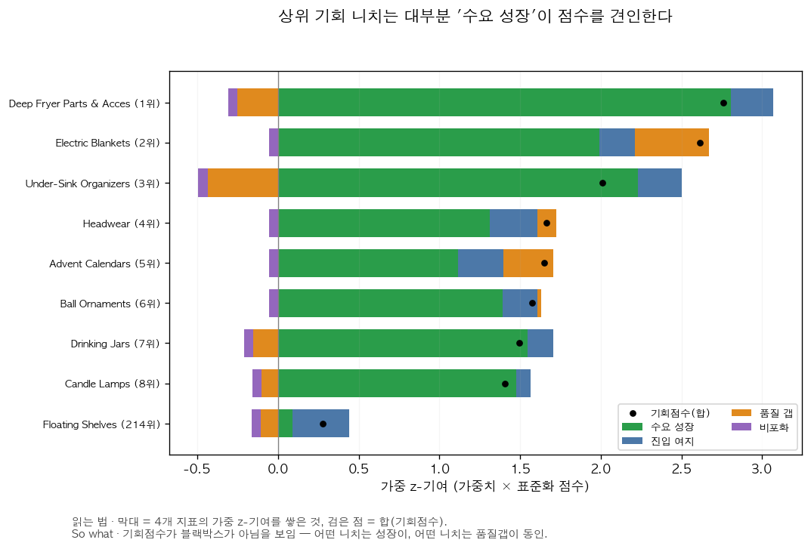
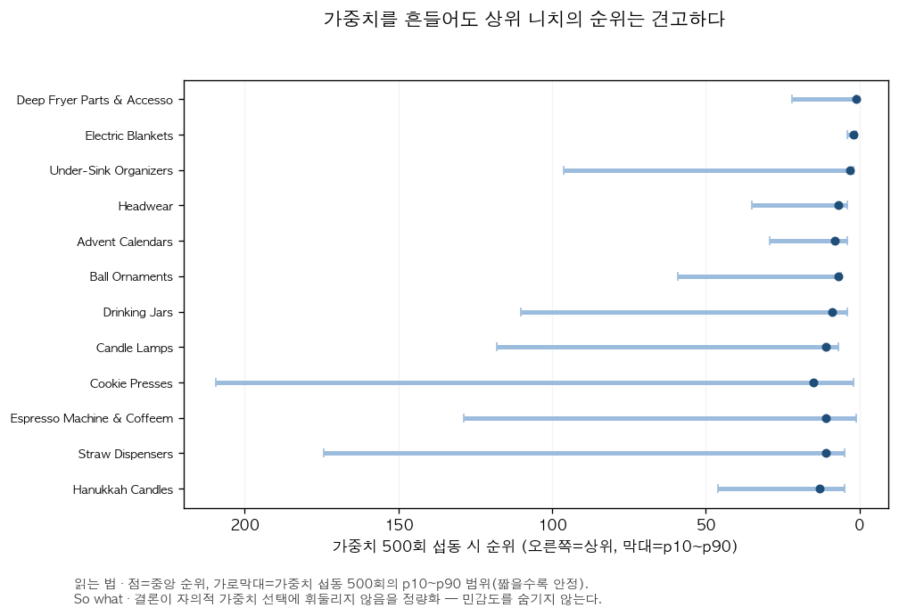

# Q1 — 니치 기회 스코어카드

> 자동 생성: `src/analyze/niche_score.py` · 점수는 z-표준화 지표의 가중합.
> 창: 최근 12개월 vs 직전 12개월 · 필터: 관측 ≥6개월 & 평균 활성상품 ≥20 (제외 548개 니치)

**해석 제한(L-1)**: 리뷰는 판매의 불완전 프록시. 수요는 절대량이 아니라 *증가율(추세)* 로만 반영했고, 점수는 니치 *간* 순위가 아니라 *상대적 진입 매력도*의 참고치로만 해석한다.

가중치(기본): demand_growth 0.35, market_openness 0.25, quality_gap 0.25, uncrowded 0.15

> 우상단(성장+개방)=진짜기회. 성장하면서 안 붐비는 니치는 906개 중 소수뿐이고, 셀러가 들어간 Floating Shelves(★)는 좌측 쇠퇴 구역에 있었다.

## 기회 점수 상위 니치

| 랭크 | 니치 | 점수 | 수요증가 | 진입여지 | 품질갭(≤2★) | 비포화 | top5안정성 | 타깃 |
|---:|---|---:|---:|---:|---:|---:|---:|:--:|
| 1 | Deep Fryer Parts & Accessories | +2.76 | +123% | 0.88 | 0.11 | 0.00 | 82% |  |
| 2 | Electric Blankets | +2.61 | +80% | 0.86 | 0.30 | 0.00 | 91% |  |
| 3 | Under-Sink Organizers | +2.01 | +92% | 0.89 | 0.06 | 0.00 | 64% |  |
| 4 | Headwear | +1.67 | +44% | 0.90 | 0.21 | 0.00 | 38% |  |
| 5 | Advent Calendars | +1.65 | +34% | 0.89 | 0.26 | 0.00 | 28% |  |
| 6 | Ball Ornaments | +1.57 | +48% | 0.86 | 0.18 | 0.00 | 5% |  |
| 7 | Drinking Jars | +1.50 | +56% | 0.82 | 0.14 | 0.00 | 28% |  |
| 8 | Candle Lamps | +1.41 | +53% | 0.78 | 0.15 | 0.00 | 0% |  |
| 9 | Cookie Presses | +1.40 | -1% | 0.49 | 0.55 | 0.00 | 33% |  |
| 10 | Espresso Machine & Coffeemaker Combos | +1.40 | -8% | 0.45 | 0.38 | 0.69 | 38% |  |
| 11 | Straw Dispensers | +1.38 | +59% | 0.68 | 0.16 | 0.00 | 18% |  |
| 12 | Hanukkah Candles | +1.33 | -2% | 0.66 | 0.35 | 0.33 | 16% |  |
| 13 | Electric Space Heaters | +1.18 | +16% | 0.83 | 0.25 | 0.00 | 0% |  |
| 14 | Artificial Snow | +1.16 | +22% | 0.74 | 0.26 | 0.00 | 0% |  |
| 15 | Dried Plants | +1.15 | +35% | 0.86 | 0.13 | 0.00 | 0% |  |

⚠ = 직전 창 데이터 없음(증가율 중앙값 대치). ★ = 셀러 자사(hexagon) 상품이 속한 니치.

## 점수 분해 — 무엇이 점수를 견인하나

기회점수는 블랙박스가 아니다. 상위 니치 대부분은 *수요 성장*이 점수를 견인하며, 어떤 니치는 품질갭·진입여지가 동인이다. (가중 z-기여 분해)

## 가중치 민감도

- 섭동 500회(Dirichlet α=8) 랭킹과 기본 랭킹의 평균 Spearman 상관: **0.858**
  (1에 가까울수록 가중치를 흔들어도 순위가 안정적 → 결론이 가중치에 덜 민감)
- `prob_top_n`: 가중치를 흔들었을 때 해당 니치가 상위 5에 드는 빈도. 이 값이 높은 니치가 가중치와 무관하게 견고한 기회.

## 셀러 타깃 니치 회고 검증

- 셀러 주력 니치 `Floating Shelves`(자사 hexagon 상품 277개): 기회점수 +0.28 (랭크 214/906), 수요증가 -20%. "당시 이 분석이 있었다면 이 니치에 진입했을까?"의 정량 근거.
