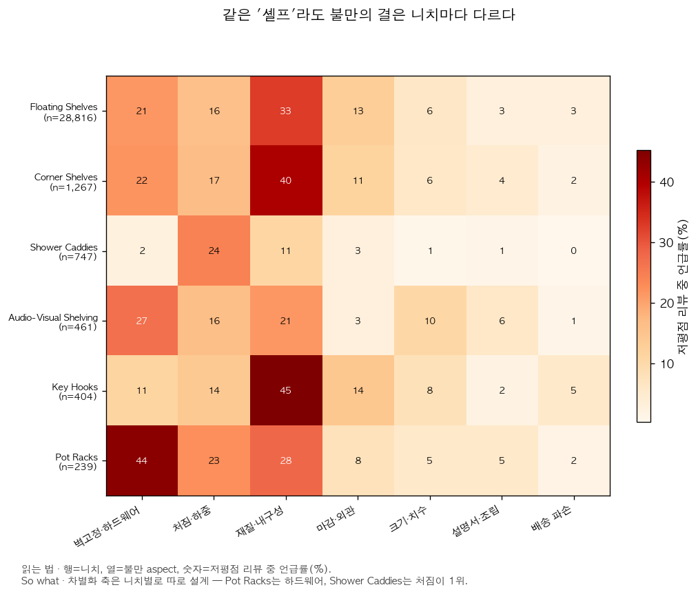
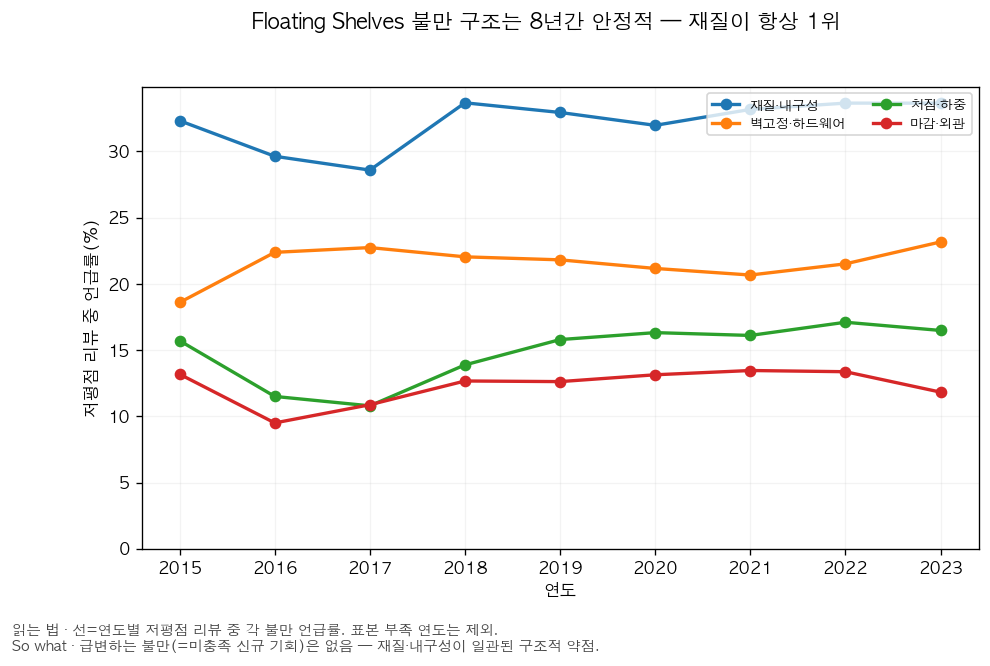

# Q2 — 미충족 니즈 텍스트 마이닝

> 자동 생성: `src/analyze/unmet_needs.py` · 대상: 저평점(≤2★) 리뷰 · 1차 니치: **Floating Shelves**(저평점 리뷰 28,816건)

**방법(교차검증)**: ① aspect 사전 = 셸프 불만의 *조작적 정의*(규칙·투명) → 유병률 측정, ② NMF 비지도 토픽 = 사전이 놓친 신호 점검. 임베딩/LLM을 쓰지 않은 이유는 decisions.md D-014.

## Floating Shelves — 미충족 니즈 순위 (저평점 리뷰 중 언급 비율)

| 순위 | 불만 aspect | 유병률 | 차별화 진입점(So what) |
|---:|---|---:|---|
| 1 | 재질·내구성 | 33% | 원목/후판 등 소재 등급 상향, 두께·재질 사진 전면 배치 |
| 2 | 벽 고정·하드웨어 | 21% | 동봉 앵커/나사를 드라이월·스터드용 고급 하드웨어로 업그레이드, 설치 영상 제공 |
| 3 | 처짐·흔들림·하중 | 16% | 하중 스펙 명시 + 히든 브래킷 보강, '처지지 않는' 메시지로 차별화 |
| 4 | 마감·외관 | 13% | 마감 QC 강화, 색상·결 실물 사진, 휨 방지 포장 |
| 5 | 크기·치수 기대 불일치 | 6% | 치수 다이어그램·실측 사진으로 기대 일치, 사이즈 옵션 확대 |
| 6 | 설명서·조립 | 3% | 단계별 그림 설명서 + QR 설치영상, 부속 체크리스트 동봉 |
| 7 | 배송 파손 | 3% | 모서리 보강 포장으로 전송 중 파손 방지 |

### 상위 불만 대표 리뷰 (helpful_vote 순)

**재질·내구성** (33%)
- «Don’t waste your money!» Very disappointed. These are 2- 2x6 boards cut on a chop saw with some cheap stain lathered on. The machine marks from the lumberyard are still visible. Nothing has been sanded. I’m all about a rustic
- «Very very very poor stability!!!!» IM VERY VERY DISPLEASED WITH THIS PRODUCT!!!!!! So to keep it brief I stalled these shelves on a wall to display some of my collection of mugs that I get from my travels. To me they are priceless and 
- «Awful for the price» Honestly I was going to make my own but was crunched for time so thought I would order these because they looked nice in the picture. First they don’t come with instructions to install thankfully my h

**벽 고정·하드웨어** (21%)
- «A half finished product at a fully finished price.» Dont bother. The included hardware disintegrates. The ends of the boards aren't stained the same as the other surfaces and are not finished/sanded. The boards have no recess for the brackets so the br
- «Don't waste your money!!!!!» I couldn't be more disappointed if I tried. I set this thing up and it took maybe 10 minutes for it to fall apart. Screwed in the screws in each section and I didn't even tighten them as hard as they 
- «Ignore the sellouts who give 5 star reviews for cash, these shelves are mediocre» Please ignore all of these paid reviews, these shelves are surprisingly underwhelming giving the current overall rating. 1. There are no instructions. Hanging shelves isn't super complicated, but some

**처짐·흔들림·하중** (16%)
- «Awful for the price» Honestly I was going to make my own but was crunched for time so thought I would order these because they looked nice in the picture. First they don’t come with instructions to install thankfully my h
- «Very very very poor stability!!!!» IM VERY VERY DISPLEASED WITH THIS PRODUCT!!!!!! So to keep it brief I stalled these shelves on a wall to display some of my collection of mugs that I get from my travels. To me they are priceless and 
- «Dangerous» I follow the directions explicitly installing it into the beams using a stud finder the following with in one day the shelf’s support beam snapped and fell off-the-wall breaking an antique bowl that w

**마감·외관** (13%)
- «Area Man Buys Horrible Shelves, Contemplates Life's Choices» The construction was so bad on these, I took pictures, sent them to buddies, and they asked if I got drunk, blindfolded myself, and used a jack hammer and a set of boxing gloves to build these shelves
- «Read the reviews!» Very disappointed. The shelves arrived with stain on the top and bottom but no stain on the sides. If the “boards” looked nice, I would’ve just stained the sides myself and kept them. However, they lo
- «Don’t waste your money!» Very disappointed. These are 2- 2x6 boards cut on a chop saw with some cheap stain lathered on. The machine marks from the lumberyard are still visible. Nothing has been sanded. I’m all about a rustic

## 니치 간 비교 — aspect 유병률

동일 불만이 니치마다 얼마나 다른지. 특정 불만이 유독 높은 니치 = 그 축으로 진입 시 차별화 여지.

| 니치 | 저평점N | 벽 고정·하드웨어 | 처짐·흔들림·하중 | 재질·내구성 | 마감·외관 | 크기·치수 기대 불일치 | 설명서·조립 | 배송 파손 |
|---|---:|---:|---:|---:|---:|---:|---:|---:|
| Floating Shelves | 28,816 | 21% | 16% | 33% | 13% | 6% | 3% | 3% |
| Corner Shelves | 1,267 | 22% | 17% | 40% | 11% | 6% | 4% | 2% |
| Shower Caddies | 747 | 2% | 24% | 11% | 3% | 1% | 1% | 0% |
| Audio-Visual Shelving | 461 | 27% | 16% | 21% | 3% | 10% | 6% | 1% |
| Key Hooks | 404 | 11% | 14% | 45% | 14% | 8% | 2% | 5% |
| Pot Racks | 239 | 44% | 23% | 28% | 8% | 5% | 5% | 2% |

## 이 불만이 *진짜 동인*인가 — lift·심각도 (Floating Shelves, 심화)

유병률만으로는 '저평점에 흔한 단어'와 '저평점을 *만드는* 불만'을 못 가른다. **lift = 저평점 유병률 ÷ 고평점(≥4★) 유병률**: lift≫1이면 그 aspect가 불만 리뷰에 특이적(진짜 차별화 동인), lift≈1이면 모든 리뷰에 흔한 배경어. **심각도 = 그 aspect를 언급한 리뷰의 평균 별점**(낮을수록 치명적).

| 불만 aspect | 저평점 유병률 (95% CI) | 고평점 유병률 | lift | 심각도(평균★) |
|---|---:|---:|---:|---:|
| 배송 파손 | 3% (2%~3%) | 0% | 17.9× | 2.13 |
| 재질·내구성 | 33% (32%~33%) | 4% | 7.4× | 2.62 |
| 처짐·흔들림·하중 | 16% (15%~16%) | 2% | 7.0× | 2.65 |
| 마감·외관 | 13% (12%~13%) | 4% | 2.9× | 3.29 |
| 크기·치수 기대 불일치 | 6% (6%~7%) | 3% | 2.0× | 3.50 |
| 벽 고정·하드웨어 | 21% (21%~22%) | 12% | 1.8× | 3.63 |
| 설명서·조립 | 3% (3%~3%) | 2% | 1.2× | 3.90 |

> **읽는 법**: lift가 가장 높은 **배송 파손**(lift 17.9×)는 고평점에선 드물고 저평점에 몰린 = 불만의 진짜 동인. 유병률이 높아도 lift≈1인 aspect는 차별화 포인트로 약하다.

## 불만 추세 — 연도별 유병률 (Floating Shelves, 저평점 리뷰 중)

오르는 불만 = 시장이 아직 못 푼 미충족 니즈(진입 시 선점 여지). 표본 부족 연도는 제외.

| 연도 | 저평점N | 벽 고정·하드웨어 | 처짐·흔들림·하중 | 재질·내구성 | 마감·외관 | 크기·치수 기대 불일치 | 설명서·조립 | 배송 파손 |
|---:|---:|---:|---:|---:|---:|---:|---:|---:|
| 2015 | 554 | 19% | 16% | 32% | 13% | 7% | 3% | 3% |
| 2016 | 800 | 22% | 12% | 30% | 10% | 7% | 2% | 2% |
| 2017 | 1,214 | 23% | 11% | 29% | 11% | 7% | 3% | 2% |
| 2018 | 1,729 | 22% | 14% | 34% | 13% | 6% | 2% | 3% |
| 2019 | 2,742 | 22% | 16% | 33% | 13% | 7% | 4% | 3% |
| 2020 | 5,657 | 21% | 16% | 32% | 13% | 6% | 3% | 3% |
| 2021 | 7,216 | 21% | 16% | 33% | 13% | 6% | 3% | 3% |
| 2022 | 6,240 | 22% | 17% | 34% | 13% | 6% | 3% | 3% |
| 2023 | 2,664 | 23% | 16% | 34% | 12% | 6% | 3% | 2% |

## NMF 비지도 토픽 (사전 교차검증)

`Floating Shelves` 저평점 리뷰를 TF-IDF→NMF로 분해. 사전 aspect와 겹치면 신뢰도 ↑, 새 용어가 보이면 사전 보강 후보.

| 토픽 | 문서수 | 상위 용어 |
|---:|---:|---|
| 5 | 5,613 | wall, screws, anchors, holes, screw, install, hardware, didn |
| 2 | 5,021 | came, broken, product, damaged, box, arrived, missing, return |
| 1 | 4,637 | wood, cheap, like, looks, look, looks like, just, looking |
| 4 | 3,947 | shelf, bracket, brackets, level, hold, weight, just, support |
| 7 | 3,047 | small, smaller, way, fit, expected, hold, books, size |
| 0 | 2,821 | shelves, brackets, look, hardware, hang, sturdy, nice, shelves look |
| 6 | 1,967 | quality, poor, poor quality, low, low quality, good, price, product |
| 3 | 1,763 | money, waste, waste money, don, don waste, time, worth, waste time |

## 한계와 검증

- aspect 사전은 단어경계 규칙이라 풍자/부정문 오탐 가능 → 표본 60건을 `q2_validation_sample.md`로 분리해 수동 검수(정합성 확인).
- 저평점 리뷰는 불만에 편향된 표본 → '미충족 니즈의 존재'는 보이나 '전체 고객 중 비율'은 아님.
- 리뷰≠판매(L-1), 키워드 니치 정의 잔여 오탐(L-6)은 상위 문서 참조.
