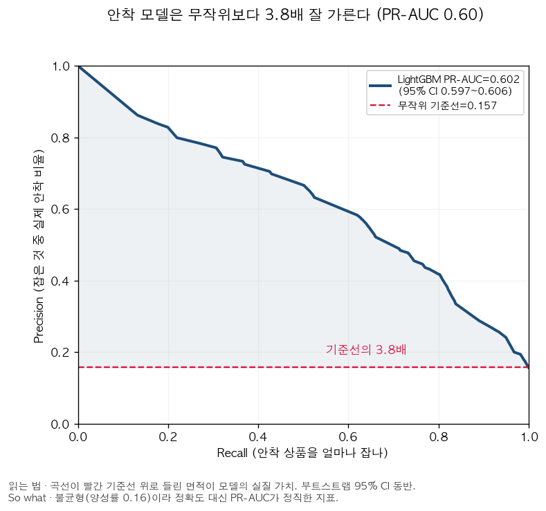
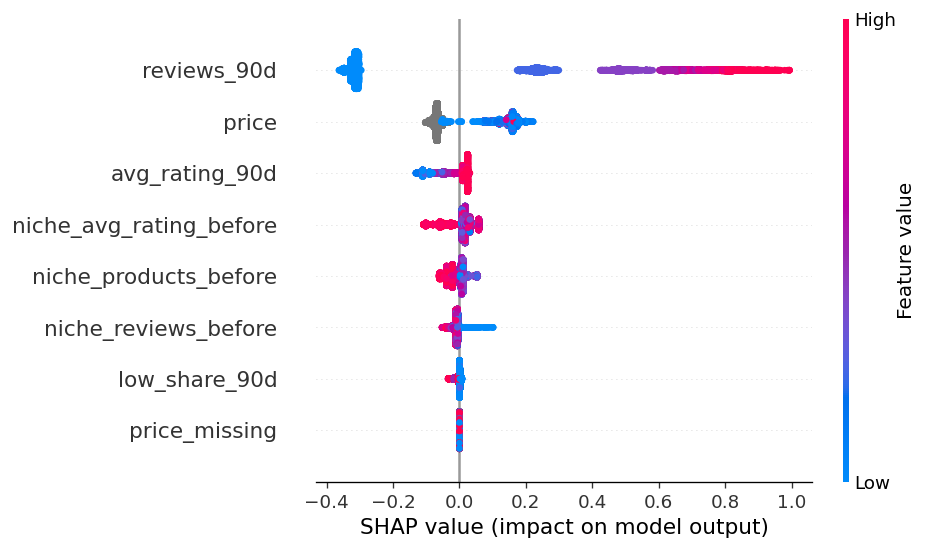
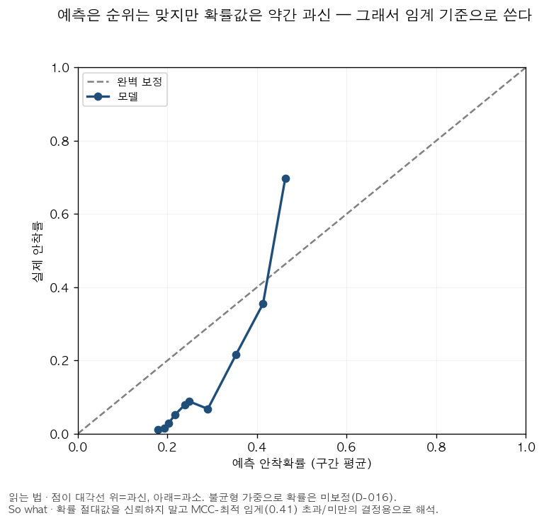
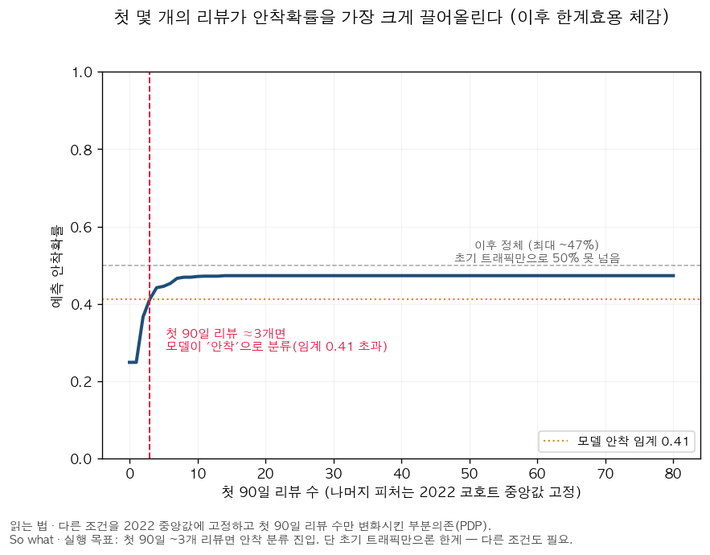
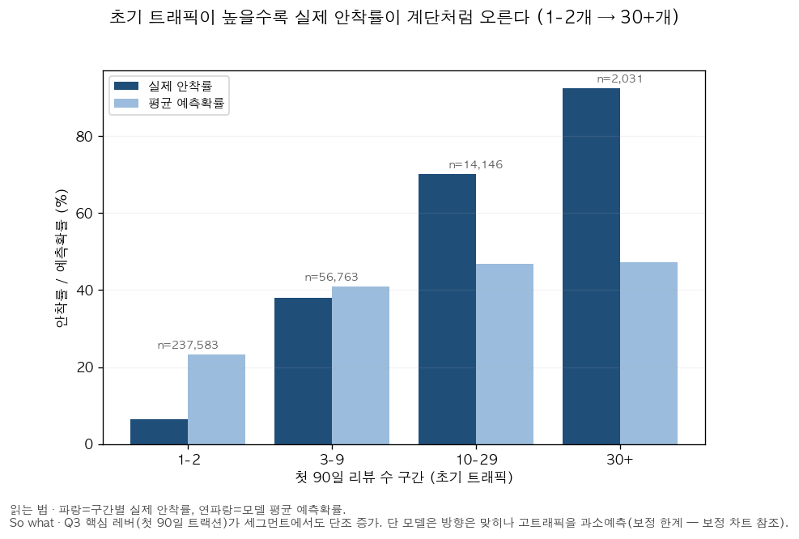

# Q3 — 시장 안착 예측 모델 (모델 카드)

> 자동 생성: `src/analyze/settlement_model.py` · 단위: 출시 코호트(mart_launch)

## 문제 정의와 모집단 (정직성)

- **타깃**: 출시 후 *안착*(later traction 지속) vs *조기 정체*. 생존편향(L-2)상 리뷰 0개로 사라진 상품은 데이터에 없으므로 '성공 예측'이 아니라 '리뷰를 받은 상품 중 안착 vs 정체'다.
- **안착의 조작적 정의**: 출시 90~365일 리뷰 수가 니치별 P75(train 연도로 산정) 이상(하한 3). 평점 게이트는 피처와의 누수(corr≈0.92)로 제거 — 안착은 '지속되는 후기 트랙션 볼륨'으로만 정의(D-016).
- **양성률**: train 21.1% / valid 15.5% / test 15.7% (시간에 따른 드리프트 존재 — 오래된 코호트가 성숙).

## 누수 방지 설계 (R4 / D-015 / D-016)

- **라벨 윈도우**: 초기창 이후(90~365일) 트랙션 → 피처 `reviews_90d`(첫 90일)가 라벨에 기계적으로 포함되지 않음.
  점검: corr(reviews_90d, 후기 트랙션)=0.65 vs corr(reviews_90d, 12개월 전체)=0.79. 후기창 정의가 기계적 성분을 줄임. 남은 상관은 '초기 견인 → 후기 견인'의 정당한 신호(누수 아님).
- **니치 임계**: train 연도만으로 산정한 P75를 valid/test에 적용 → 라벨이 미래(test) 결과를 엿보지 않음(D-016, 감사에서 발견된 잔여 누수 수정).
- **평점 게이트 제거**: avg_rating_12m(라벨 후보)는 피처 avg_rating_90d와 corr≈0.92로 라벨-피처 누수 → 제거. 안착은 후기 트랙션 볼륨으로만 정의(D-016).
- 모든 피처는 출시 시점/첫 90일에 관측 가능. `launch_year`는 피처가 아니라 split 키.

## 검증 설계

- **시간 기반 split**: train(≤2020, n=1,975,426) → valid(2021, n=519,154) → test(2022, n=310,523). 랜덤 split 금지.
- 불균형 → **PR-AUC를 1차 지표**. 임계값은 valid에서 **MCC 최대화**로 선택 후 test 적용.

## 성능 (test 셋)

| 모델 | PR-AUC | ROC-AUC | Brier | Precision | Recall | MCC |
|---|---:|---:|---:|---:|---:|---:|
| LogReg (베이스라인) | 0.603 | 0.863 | 0.149 | 0.55 | 0.63 | 0.505 |
| LightGBM (주모델) | 0.602 | 0.864 | 0.119 | 0.58 | 0.62 | 0.524 |

- test 양성률(무작위 기준선 PR-AUC) = **0.157**. LightGBM PR-AUC 0.602 → 기준선 대비 3.8배.
- 선택 임계값 0.412에서 혼동행렬(test): TP=30,264 FP=21,688 FN=18,534 TN=240,037.

> 불균형(양성률 0.157)이라 정확도가 아닌 PR-AUC가 정직한 지표. 곡선이 기준선 위로 들린 면적이 모델의 실질 가치.

## 피처 기여 (SHAP · LightGBM)

| 피처 | 평균 |SHAP| | 방향 |
|---|---:|---|
| 첫 90일 리뷰 수(log) | 0.388 | ↑(높을수록 안착) |
| 가격 | 0.106 | ~중립 |
| 첫 90일 평균 평점 | 0.035 | ↑(높을수록 안착) |
| 출시 시점 니치 평균평점 | 0.027 | ↓(높을수록 정체) |
| 출시 시점 니치 상품수(log) | 0.014 | ↓(높을수록 정체) |
| 출시 시점 니치 리뷰수(log) | 0.010 | ↓(높을수록 정체) |
| 첫 90일 저평점 비율 | 0.002 | ↓(높을수록 정체) |
| 가격 결측 여부 | 0.000 | ~중립 |

## 심화 진단 (D-019)

**보정 곡선** — 예측 확률은 순위는 맞으나 미보정(과신/압축) → 절대값 대신 임계 기준으로 사용

**안착 임계(PDP)** — 첫 90일 리뷰가 안착확률을 가장 크게 끌어올리되 한계효용 체감 — 초기 트래픽만으론 50% 못 넘음

**초기 트래픽 세그먼트** — 실제 안착률이 트래픽 구간 따라 6%→92%로 단조 증가(모델은 고트래픽 과소예측)

## 비즈니스 해석 (So what — 신규 셀러 진입 의사결정)

- 안착을 가르는 가장 큰 초기 레버는 **첫 90일 리뷰 수(log)**(압도적), 그 다음 가격·첫 90일 평균 평점. 즉 출시 직후 트랙션이 안착 확률을 가장 크게 좌우하고, 초기 평점은 부차적으로 기여한다.
- 진입 결정에 쓰는 법: 첫 90일 지표를 이 모델에 넣어 안착 확률을 추정 → 임계 미만이면 리스팅/가격/초기 리뷰 확보 전략을 보강하거나 진입을 재고. (Q2 미충족 니즈가 초기 평점 방어의 구체 레버를 제공)

## 한계

- 라벨이 니치 상대 P75 기준 → '안착' 정의가 임계에 민감(분위/하한은 config화).
- 불균형 가중(scale_pos_weight/class_weight)으로 예측확률은 보정(calibration)되지 않음 → Brier는 참고치. 순위 지표(PR-AUC·ROC-AUC)와 임계 기반 지표(MCC) 위주로 해석.
- 출시일=첫 리뷰일 프록시(L-3): 첫 90일 창이 실제 출시 후 시점과 어긋날 수 있음.
- 리뷰≠판매(L-1), 생존편향(L-2)은 모집단·타깃 명명으로만 완화되며 제거되지 않음.
