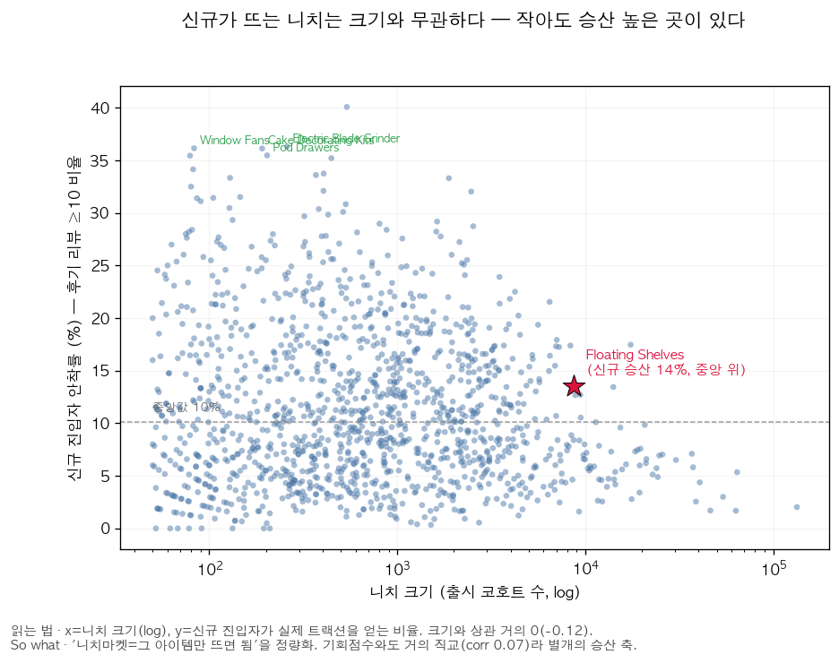

# 아마존 신규 셀러 카테고리 진입 — 의사결정 메모

> 형식: 투자 의사결정 메모 (요약 → 프레임워크 → 근거 → 회고 → 리스크 → 결론)
> 데이터: Amazon Reviews 2023 (Home & Kitchen, 리뷰 6,200만 건, 2015-01~2023-09)
> 분석: Q1 니치 기회 스코어링 · Q2 미충족 니즈 마이닝 · Q3 안착 예측
> 작성: 전직 셀러 관점 · 모든 수치는 자동 생성 산출물(`docs/q1~q3`)·의사결정 기록(`docs/decisions.md`)에 근거

---

## 0. 한 줄 결론 (TL;DR)

**신규 셀러의 카테고리 진입은 "키워드가 뜨는가"가 아니라 세 질문에 동시에 답해야 하는 의사결정이다:
① 이 니치가 구조적으로 열려 있는가(Q1) ② 고객 불만에 차별화 진입점이 있는가(Q2)
③ 내 초기 조건이 안착으로 이어질 신호인가(Q3).** 이 메모는 그 프레임워크를 데이터로 만들고,
내가 실제로 진입했던 니치(Floating Shelves)에 거꾸로 적용해 검증한다.

---

## 1. 의사결정 프레임워크 — 진입 전에 봤어야 할 세 렌즈

| 렌즈 | 질문 | 산출물 | 진입 판단에 주는 답 |
|---|---|---|---|
| **Q1 기회** | 이 니치가 수요·경쟁 구조상 열려 있나? | 니치 기회 스코어카드(906니치) | "들어갈 가치가 있는 시장인가" |
| **Q2 차별화** | 고객은 무엇에 불만인가? | 니치별 불만 aspect 유병률 | "어떻게 다르게 만들 것인가" |
| **Q3 안착** | 내 초기 조건이 안착 신호인가? | 안착 예측 모델 + SHAP | "내가 들어가면 살아남을 조건인가" |

세 렌즈는 **하나의 결정에 수렴**한다 — Q1이 "어디", Q2가 "어떻게", Q3가 "내 조건이면 되는가".
어느 하나만 보면(예: 키워드 상승만) 진입이 틀어진다. 이 메모의 핵심 주장이다.

---

## 2. 근거 ① — Q1: 기회는 "성장하면서 덜 붐비는" 니치에 있다

수요 모멘텀(리뷰 증가율)·진입 여지(상위5 집중도의 역)·품질 갭(저평점 비율)·비포화(신규진입강도의 역)를
z-표준화 가중합. **점수 자체가 아니라 가중치 민감도가 진짜 산출물** — 가중치를 500회 흔들어도 상위
니치 순위가 유지되는지(평균 Spearman **0.858**)를 함께 보고해 "결론이 가중치 선택에 얼마나 민감한가"를
정직하게 드러낸다.

| 상위 기회 니치 | 기회점수 | 수요증가 | 해석 |
|---|---:|---:|---|
| Deep Fryer Parts & Accessories | +2.76 | +123% | 본체가 아닌 *소모성 부속* — 재구매·낮은 경쟁 |
| Electric Blankets | +2.61 | +80% | 계절 수요 성장 + 진입 여지 |
| Under-Sink Organizers | +2.01 | +92% | 수납 트렌드 + 낮은 집중도 |

> **L-1(리뷰≠판매) 반영**: 수요는 절대 리뷰량이 아니라 *증가율(추세)*로만 점수에 넣어 니치 간
> 절대 비교를 구조적으로 회피한다. 점수는 순위가 아니라 *상대적 진입 매력도의 참고치*로만 해석.

### 2-1. 보강 — "니치마켓이면 크기보다 그 아이템이 뜨느냐가 관건 아닌가?"

타당한 반론이라 데이터로 정식화했다. 각 니치에서 **신규 진입 상품이 실제로 트랙션을 얻는 비율**
(출시 90~365일 후기 리뷰 ≥10인 비율, 절대 기준 — Q3 안착을 니치 단위로 역집계)을 잰다.

- **신규 승산은 니치 크기와 거의 무관**(상관 −0.12) — *작아도 신규가 잘 뜨는 니치가 실재*한다
  (예: Window Fans·Cake Decorating Kits·Electric Blade Grinders, 출시 100~260개인데 승산 중앙값의 3배+).
  "니치마켓이면 크기와 별개로 내 아이템만 뜨면 된다"는 직관을 **데이터가 지지**한다.
- 게다가 이 '신규 승산'은 **기존 Q1 기회점수와도 거의 직교(상관 0.07)** — 수요성장·집중도로 만든
  점수가 *못 잡는 별개의 정보*다. 진입 판단에 추가해야 할 독립 축.
- **셀러 니치 재해석**: Floating Shelves 신규 승산 **14%**로 *중앙값(10%) 위*. 즉 "이 니치에선
  신규가 못 뜬다"가 아니다. 진짜 진단은 **'시장이 작아서'가 아니라 '내 아이템을 뜨게 만드는
  조건(차별화 축·초기 트랙션)을 못 맞춰서'** — Q2·Q3가 그 조건을 가리킨다. (상세: `docs/q1_newcomer_winnability.md`)

## 3. 근거 ② — Q2: 차별화 진입점은 저평점 리뷰에 적혀 있다

셀러 주력 니치 **Floating Shelves**의 저평점(≤2★) 리뷰 28,816건을 규칙 aspect 사전(조작적 정의)으로
분해하고 NMF 비지도 토픽으로 교차검증했다(임베딩/LLM을 안 쓴 이유는 D-014 — 투명·재현·감사가능).

| 불만 순위 | aspect | 유병률 | lift(저평점÷고평점) | 차별화 진입점(So what) |
|---:|---|---:|---:|---|
| 1 | 재질·내구성 | **33%** | **7.4×** | 원목/후판 등 소재 등급 상향, 두께·재질 사진 전면 배치 |
| 2 | 벽 고정·하드웨어 | 21% | 1.8× | 하드웨어 업그레이드(단, lift 낮아 차별화 효력은 제한적) |
| 3 | 처짐·흔들림·하중 | 16% | **7.0×** | 하중 스펙 명시 + 히든 브래킷 보강 |

**유병률만으로는 부족하다 — lift로 진짜 동인을 가린다(심화).** lift = 저평점 유병률 ÷ 고평점(≥4★)
유병률. **재질·내구성(7.4×)·처짐(7.0×)은 유병률도 높고 lift도 높아 진짜 불만 동인**인 반면,
**하드웨어는 유병률 2위(21%)지만 lift가 1.8×에 불과** — 고평점 리뷰에도 12%나 등장하는 *배경어*에
가까워 차별화 효력이 약하다. 심각도(언급 리뷰 평균 별점)도 재질 2.62★·처짐 2.65★로 가장 치명적.
→ **차별화 1순위 축은 '하드웨어'가 아니라 '재질·내구성'**으로 수정된다(유병률만 봤다면 놓쳤을 결론).

**니치마다 불만의 결이 다르다** — Pot Racks는 하드웨어 불만이 44%로 높고, Shower Caddies는
하드웨어 2%·처짐 24%. 즉 *차별화 축은 니치별로 다르게 설계*해야 한다. NMF 토픽(하드웨어/재질/
처짐/배송파손/품질)이 사전과 독립적으로 같은 축을 재현해 신호의 타당성을 교차확인했다.

## 4. 근거 ③ — Q3: 안착은 "출시 직후 모멘텀"이 가장 잘 가른다

출시 코호트로 "안착 vs 조기 정체"를 분류한다. 생존편향(L-2)상 리뷰 0개 상품은 데이터에 없으므로
'성공 예측'이 아니라 '리뷰를 받은 상품 중 안착 vs 정체'다. **누수 차단이 이 분석의 자존심**:
라벨을 *초기창 이후(90~365일) 트랙션*으로 정의해 첫 90일 피처와 기계적으로 겹치지 않게 했고,
자체 감사에서 잔여 누수 2건(니치 임계 산정 범위·평점 게이트)을 더 찾아 제거했다(D-016).

| 지표(test 2022) | LightGBM | 해석 |
|---|---:|---|
| PR-AUC | **0.602** | 무작위 기준선(0.157)의 **3.8배** |
| ROC-AUC | 0.864 | |
| MCC | 0.524 | 임계값은 검증셋에서 MCC 최대화로 선택 |

> **누수 수정 후 성능이 거의 불변**(PR-AUC 0.603→0.602) → 성능이 누수가 아니라 진짜 신호였음을 입증.

**SHAP 해석**: `첫 90일 리뷰 수`(0.387) ≫ `가격`(0.106, 방향 중립) > `첫 90일 평균 평점`(0.035, 소폭 양). 즉 **출시 직후 트랙션이 안착을 압도적으로 좌우**하고,
초기 평점은 부차적으로 양의 기여를 한다. 니치의 사전 경쟁 상태(상품수·리뷰수)는 기여가 작다 —
*"붐비는 니치냐"보다 "내가 초반에 모멘텀을 만드냐"가 더 중요*하다는 뜻.

---

## 5. 통합 — 세 렌즈가 만드는 하나의 진입 플레이북

1. **Q1으로 후보를 좁힌다**: 성장(수요증가율)하면서 덜 붐비는(낮은 집중도) 니치. 가중치 민감도가
   견고한 니치만 신뢰.
2. **Q2로 차별화 가설을 만든다**: 후보 니치의 저평점 리뷰에서 최빈 불만을 찾아 그 축으로 제품을 설계.
   (예: 셸프라면 재질·하드웨어 → 소재 등급 + 설치 키트)
3. **Q3로 내 조건을 시뮬레이션한다**: 첫 90일 트랙션·초기 평점 목표를 세우고, 안착 확률이 임계 미만이면
   리스팅/가격/초기 리뷰 확보를 보강하거나 진입을 재고.

**Q2와 Q3는 한 지점에서 맞물린다** — Q3는 "출시 직후 트랙션이 안착을 좌우하고 초기 평점도 양의
기여를 한다"고 말하고, Q2는 그 초기 평점을 지킬 *구체 행동*(재질 상향·하드웨어 업그레이드)을 제공한다.

---

## 6. 셀러 회고 — 내 결정에 이 틀을 적용하면

나는 Floating Shelves에 진입할 때 **Helium10 키워드 랭킹 상승세**를 봤고, 시장에 **매트화이트
색상 공백**이 있다고 판단했으며, **사이즈별 1세트 구성**으로 차별화했다. 감만은 아니었다.

그러나 이 틀로 보면:
- **Q1**: Floating Shelves는 906니치 중 **214위**, 최근 수요 **−20%** — 성숙·정체 시장이었다.
  키워드 상승은 *내 키워드*의 단면이었지, *니치 전체*의 구조가 아니었다.
- **Q2**: 그 니치의 1·2위 불만은 재질(33%)·하드웨어(21%). 내 차별화 축(색상·세트 구성)은
  고객이 가장 아파하는 지점이 아니었다.
- **Q3**: 안착의 핵심 레버는 색상/세트가 아니라 *출시 직후 트랙션*(과 부차적으로 초기 평점)이었다.

**교훈은 "내 판단이 틀렸다"가 아니라, 키워드 상승·색상 공백이라는 단편 신호만으로는 니치의
경쟁 구조·고객 불만·안착 조건을 충분히 보지 못한다는 것**이다. 진입 전에 이 세 렌즈로 봤어야 했다.

---

## 7. 리스크와 한계 (정직성)

| 한계 | 영향 | 대응 |
|---|---|---|
| 리뷰 ≠ 판매 (L-1) | 높음 | 수요는 증가율·상대비교로만 해석, 절대 비교 금지 |
| 생존 편향 (L-2) | 높음 | 타깃을 "안착 vs 정체"로 명명, 모집단 명시 |
| 첫 리뷰일=출시일 프록시 (L-3) | 중간 | "관측 가능한 첫 수요 반응 시점"으로 해석 |
| 2023-09 컷오프 (L-4) | 중간 | "지금 들어가라"가 아니라 *프레임워크 + 과거 검증*으로 프레이밍 |
| 라벨 임계 민감성·잔여 누수 (L-8/L-9) | 중간 | 파라미터 config화, 자체 감사로 누수 2건 제거(D-016) |

이 프로젝트의 진짜 차별점은 모델 정확도가 아니라 **한계를 측정해 해석 범위를 제한하는 태도**다.

---

## 8. 결론

신규 셀러에게 "들어갈 니치"를 단정해 주는 것은 데이터 컷오프(2023-09)상 정직하지 않다.
대신 이 프로젝트가 주는 것은 **진입 전에 통과시켜야 할 세 렌즈(Q1 기회·Q2 차별화·Q3 안착)**와,
그것을 내 실제 결정에 적용해 검증한 사례다. **키워드가 뜨는 것과 니치가 열려 있는 것은 다르고,
색상 공백이 있는 것과 고객이 그것에 불만인 것은 다르며, 차별화가 있는 것과 초기 모멘텀이 있는 것은
다르다.** 이 세 가지를 분리해서 보는 것이 이 메모의 결론이다.
